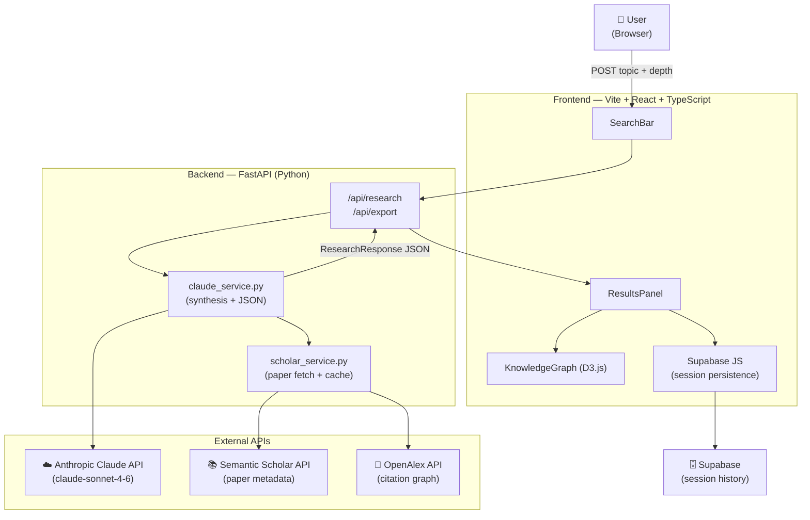

<!-- Master README — this is the portfolio face of the project. Update every week. -->
<!-- Include: project summary, architecture diagram, tech stack, local setup, deployment, screenshots. -->

<div align="center">

# Footnote — AI-powered Research Intelligence

[](https://footnote.vercel.app)
[](https://github.com/goodvibepublishing/footnote/actions)

[](https://react.dev)
[](https://www.typescriptlang.org)
[](https://fastapi.tiangolo.com)
[](https://www.python.org)
[](https://d3js.org)
[](https://supabase.com)
[](https://vercel.com)

<br/>


*Drop a research topic. Get a structured intelligence briefing in seconds.*

</div>

---

## What is Footnote?

Academic search is broken for everyone except academics. A graduate student, product manager, or curious professional who types a research topic into a search engine gets back ten blue links — raw, unranked, and completely unconnected to each other. Footnote fixes this. It takes any free-text research question, fetches real papers from Semantic Scholar and citation data from OpenAlex, then hands the full context to Claude to synthesise into a structured intelligence briefing: a plain-language summary, ranked key findings with confidence levels, an interactive knowledge graph showing how papers cite each other, a methodology comparison table, a list of top researchers in the field, identified research gaps, follow-up queries, and a one-click export to Word. The result is what a research assistant would produce in an hour — delivered in under ten seconds.

---

## Architecture



---

## Analysis Outputs

Every research request produces eight structured outputs, rendered as separate panels in the UI and included in the `.docx` export.

| # | Output | Description |
|---|--------|-------------|
| 1 | **Executive Summary** | 2–3 paragraph plain-language synthesis of the research landscape |
| 2 | **Key Findings** | Synthesised claims, each with supporting evidence, source IDs, and a `low / medium / high` confidence rating |
| 3 | **Papers Panel** | Up to 20 real papers from Semantic Scholar, with title, authors, year, venue, DOI, and citation count |
| 4 | **Knowledge Graph** | Interactive D3.js force graph showing citation relationships between retrieved papers |
| 5 | **Literature Review** | Narrative overview of how the field has evolved, grounded in the fetched papers |
| 6 | **Methodology Table** | Side-by-side comparison of experimental methods, datasets, and metrics across key papers |
| 7 | **Research Gaps** | Open problems and under-explored directions identified by Claude from the literature |
| 8 | **Top Researchers** | Authors ranked by citation count and presence in the retrieved paper set |

---

## Local Setup

```bash
# 1. Clone the repo
git clone https://github.com/goodvibepublishing/footnote.git && cd footnote

# 2. Add your secrets
cp backend/.env.example backend/.env   # fill in ANTHROPIC_API_KEY + SUPABASE_* values

# 3. Spin up both services
docker-compose up

# 4. Open the app
open http://localhost:5173
```

> **Prerequisites:** Docker Desktop ≥ 4.x. No local Python or Node installation required — Docker handles everything.

---

## Tech Stack

| Layer | Technology | Why |
|-------|-----------|-----|
| **UI framework** | React 18 + TypeScript 5 | Hooks-based component model keeps the async mutation state (loading → data → error) clean and testable; TypeScript catches contract mismatches between frontend and the Pydantic API at compile time |
| **Build tool** | Vite 5 | Sub-second HMR for tight iteration loops; first-class TypeScript and React support out of the box |
| **Data fetching** | TanStack Query v5 | Server-state cache with built-in deduplication means a re-render never fires a duplicate API call; `useMutation` gives the search flow a clean lifecycle |
| **Visualisation** | D3.js v7 | No other library produces a force-directed graph that feels physically correct at this level of control; D3 owns the SVG, React owns everything else |
| **Styling** | Tailwind CSS | Utility-first classes eliminate the naming problem entirely; no context switching between JSX and CSS files |
| **API framework** | FastAPI (Python) | Async I/O matches the pattern of fanning out to three external APIs concurrently; Pydantic v2 models validate requests and responses automatically |
| **AI synthesis** | Anthropic Claude (`claude-sonnet-4-6`) | Claude returns structured JSON reliably when given well-formed schemas in the prompt; its reasoning depth produces findings that pass the "would a domain expert say this?" bar |
| **Paper data** | Semantic Scholar API | Free, no auth required for reasonable volume, returns structured metadata (DOI, citation count, abstract) that maps directly onto the `Paper` Pydantic model |
| **Session storage** | Supabase | Postgres-backed with a real-time client library; zero-config row-level security means session data is isolated per user without writing auth code |
| **Deployment** | Vercel (frontend) + Railway/Fly (backend) | Vercel's edge network gives the React app global latency; containerised backends match the docker-compose local workflow exactly |

---

## Contributing

Contributions are welcome. The codebase is intentionally small — no abstraction layers that don't earn their place.

1. **Fork** the repo and create a branch: `git checkout -b feat/your-feature`
2. **Backend changes:** add or update tests in `backend/tests/` and run `pytest` before opening a PR
3. **Frontend changes:** run `npm run lint` and `npm test` (Vitest) locally
4. **Open a PR** against `main` with a clear description of the problem and the solution
5. A maintainer will review within 48 hours

Please open an issue before starting large features so effort isn't duplicated.

---

## Roadmap

### v1.1 — Polish & reliability
- [ ] Streaming responses — show findings panel-by-panel as Claude generates them rather than waiting for the full JSON
- [ ] OpenAlex citation graph integration — draw real citation edges in the knowledge graph instead of co-occurrence edges
- [ ] Rate-limit UI — surface the `429` state gracefully with a countdown rather than a generic error toast
- [ ] Persistent sessions — let authenticated users name, search, and share past research sessions
- [ ] PDF export alongside the existing `.docx` export

### v2.0 — Expanded intelligence surface
- [ ] Multi-query synthesis — compare two research topics side-by-side in a split-panel view
- [ ] Author network graph — show collaboration relationships between top researchers in the field
- [ ] Trend analysis — plot citation velocity over time to surface emerging vs. declining research directions
- [ ] Annotation layer — let users highlight and tag specific findings for downstream use in essays or reports
- [ ] Slack / Notion export — push a formatted briefing directly to a team workspace

---

<div align="center">

Built by [pash](mailto:goodvibepublishing@gmail.com) · MIT License

</div>
# Updated
